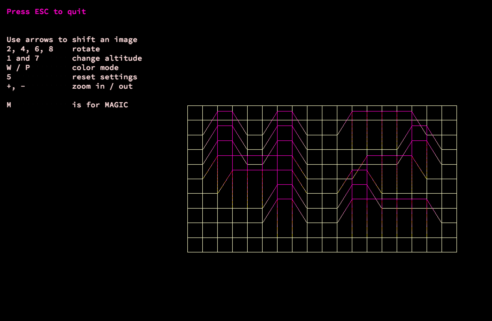
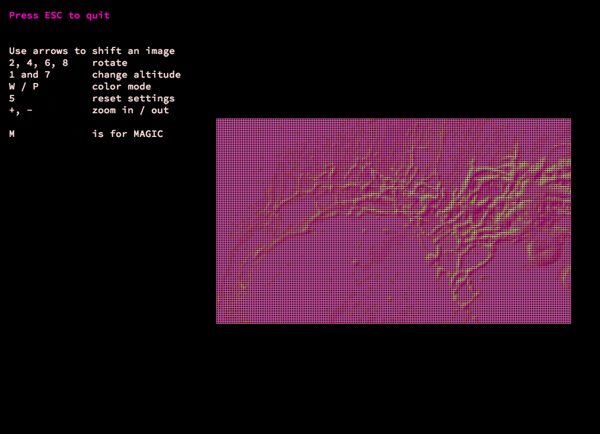

# FDF
The first project of the Computer Graphics branch in UNIT Factory (School 42 in Ukraine).

## About
This project is about creating a simplified graphic “wireframe” (“fils de fer” in french, hence the name of the project) representation of a relief landscape in 3D.
The graphic library used: ***miniLibX*** (internally developed by 42 school).

### How to run
After downloading, open a folder in terminal and run `make`. This will create an executable with object files.

The coordinates of a landscape are stored in a file passed as a parameter to the program. 
All landscape templates are stored in `maps` directory.
An example of executing a program:

`./fdf maps/42.fdf`



`./fdf maps/mars.fdf`



### Controls
```
arrows  | to move left and right, up and down

+ and - | to zoom in/out

4 and 6 | to rotate around y axis

2 and 8 | to rotate around x axis

1 ans 7 | to modify altitude

5       | to reset settings

P       | to apply color mode (coresponding to the altitude), good when colors aren't preset in a map

W       | to wipe coloring or return to preset colors if they exist

M       | to play magic sound

ESC     | to exit
```

